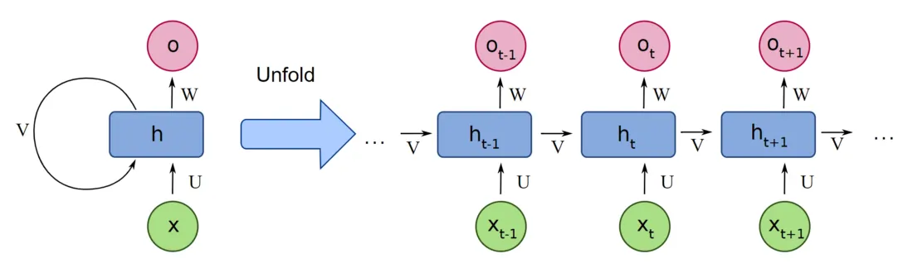

# Laboratory work №4
## RNN from Scratch on Ocaml
Андриянов Дмитрий P3312

---

## Project structure
- `lib/nnlib/nn.ml` - RNN implementation 
- `lib/nnlib/functions.ml` - Basic functions used in ML, including loss functions and their gradients 
- `bin/main.ml` - Entry point: training and inference
- `bin/utils.ml` - Functions for reading and preprocessing

## Implemented architecture

[Source of the image](https://www.analyticsvidhya.com/blog/2022/03/a-brief-overview-of-recurrent-neural-networks-rnn/)

$h_{t+1} = tanh(W_{xh} \cdot x_t + W_{hh} \cdot h_t)$
$y_{t+1} = W_{hy} \cdot h_{t+1}$

$x_t$ - Current token
$h_t$ - Hidden state

## Backpropagation 

[Source of the image](https://towardsdatascience.com/backpropagation-in-rnn-explained-bdf853b4e1c2)

For optimisation, basic mini-batch SGD is used, with gradients clipping to address the problem of exploding gradients.

## Technologies
- Owl - A scientific computations library
- Camomile - A library for processing UTF-8 symbols
